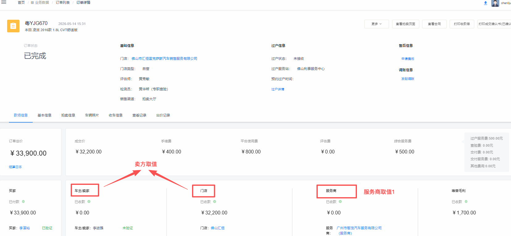

# 经营者与从业人员收入信息报送表 需求文档

| 项目 | 内容 |
| --- | --- |
| 需求名称 | FNC 钱包-报表管理-经营者与从业人员收入信息报送表 |
| 提出方 | 财务 |
| 合规依据 | 《互联网平台企业涉税信息报送规定》——经营者与从业人员收入信息报送表 |
| 落地位置 | FNC 财务系统 → 财务管理 → 报表管理 |
| 触发时机 | 每月 1 日 00:00 自动生成上月数据快照 |
| 文档版本 | v0.1（初稿，含待确认项） |
| 文档日期 | 2026-05-15 |

---

## 一、背景与目标

为满足《互联网平台企业涉税信息报送》合规要求，需在 FNC 财务系统-财务管理-报表管理中新增一张**经营者与从业人员收入信息报送表**，按月度对平台已实名认证的经营者收入数据进行汇总归档，供财务提供给税局报送。

报表需满足：
1. **完整覆盖**：覆盖所有已实名认证且认证类型为「企业」或「个体工商户」的经营者；
2. **数据准确**：金额口径、订单口径与税务报送要求一致；
3. **版本归档**：生成后形成月度快照，事后流水变动不影响已生成期间的数据；
4. **可导出**：支持按月度筛选、按经营者搜索，并按指定模板（含合并表头）导出 Excel。

---

## 二、报送对象（经营者范围）

### 2.1 入选条件
进入本报表的「经营者」需**同时满足**以下条件：
- **已实名认证**：实名认证状态 = 已通过；
- **认证主体类型**：企业 或 个体工商户（不含个人）；
- **证件号码**：取「统一社会信用代码」（旧称"组织机构代码"已统一并入统一社会信用代码，无需兼容历史口径）；
- **经营者范围**：卖家（含门店账户、车主账户，须为企业或个体工商户） + 服务商


### 2.2 不入选范围
- 未取得登记证照的用户；
- 实名认证主体类型为「个人」的用户；
- 未通过实名认证的用户。

### 2.3 零流水经营者处理
**已认证但当月零流水的经营者，仍输出一行，所有金额/笔数字段填 0。**（已确认）

### 2.4 经营者角色
| 角色 | 定义 | 报表中体现 |
| --- | --- | --- |
| 买家 | 在平台购车的用户（含门店/车主） | 不进入报表 |
| 卖家 | 在平台售车的用户（门店和车主，卖家需是企业或个体工商户） | 销售收入相关列取数 |
| 服务商 | 撮合买卖双方交易的中间服务商，以及第三方衍生服务的合作商 | 服务收入相关列取数 |

#### 角色识别口径（基于现有业务数据，不新增 `userRole` 字段）
- **不新增字段**：本次不在用户表新增 `userRole`，也不做存量服务商名单的收集与批量打标。卖家/服务商身份通过订单与服务关系直接识别。
- **卖家识别**：订单表中"车款付款给到的用户"即为卖家 —— 可能是**车主账户**，也可能是**门店账户**（含自营订单等场景，由订单数据自然区分）。
- **服务商识别**（涵盖以下两类）：
  1. **订单表中的"服务商"角色**：撮合买卖双方交易的中间服务商（如订单详情页中的"服务商"账户，收取过户/服务佣金）；
  2. **衍生服务订单 - 项目与服务商管理中的服务商**：在第三方服务下挂载的合作商（年检代办、提档代办、过户代办、铁牌费、改装修复、维修、保险等）。

#### 取值示例截图（开发参考）

**📷 示例 1：订单详情页 — 卖方取值 + 服务商取值 1**



- 截图红框中「车主/卖家」「门店」= **卖家取值**（车款付款给到的账户，可能是车主、可能是门店）；
- 截图红框中「服务商」（如示例中"广州市智茂汽车服务有限公司"）= **服务商取值 1**。

**📷 示例 2：服务中心 → 衍生服务订单 → 项目与服务商管理 — 服务商取值 2**


- 截图所示「服务合作商」列表（挂载在年检代办、提档代办、过户代办、铁牌费、改装修复、维修、保险 等第三方服务下）= **服务商取值 2**；
- 须为已认证的企业或个体工商户。

> ⚠️ **待确认 1**：同一 `userName` 是否会出现「既是卖家又是服务商」的情况？
> - 若**角色互斥**：报表每行只会有「销售收入」或「服务收入」一栏有值，另一栏为 0；
> - 若**业务上允许兼具**：报表保留「同一行销售+服务两栏并存」的合并行设计（详见 §四）。
>
> 当前文档暂按「**合并为一行、两栏可并存**」设计模板（与第一轮确认结论一致），实现细节以业务最终确认为准。

---

## 三、金额口径

### 3.1 销售收入 / 服务收入
- **取数来源**：FNC-钱包流水；
- **筛选条件**：状态 = **「已提现已清算」**；
- **时间维度**：按**提现任务已清算状态**所在月份归集；跨月情况（月底提现、次月到账）算**次月**收入；
- **角色分流**：
  - 卖家身份产生的清算流水 → 计入「销售收入」；
  - 服务商身份产生的清算流水 → 计入「服务收入」；
  - 同一 `userName` 兼具两种身份时，在同一行内分别填入对应列。

### 3.2 退款金额（按官方模板拆为两栏）
按国税总局报送表，退款需按经营性质拆分为「销售货物退款」和「销售服务退款」两栏。

- **销售货物退款金额（对应列 8）**：
  - 取数来源：FNC-钱包流水；
  - 取数逻辑：**卖家**账户对应钱包流水中，提取仲裁售后款项为负数的流水汇总（汇总后取绝对值展示）；
  - 归属期间：按售后执行时间归属当月。
- **销售服务退款金额（对应列 11）**：
  - 取数来源：FNC-钱包流水；
  - 取数逻辑：**服务商**账户对应钱包流水中，提取仲裁售后款项为负数的流水汇总（汇总后取绝对值展示）；
  - 归属期间：按售后执行时间归属当月。

### 3.3 销售/服务收入与退款的勾稽
- 平台所有退款必须经过仲裁产生（业务规则）；
- 因此清算流水中包含的仲裁负数款项，需要：
  1. 从「销售货物收入总额 / 销售服务收入总额」中**剔除**（避免重复扣减）；
  2. **归集**到对应的退款列（列 8 / 列 11）。
- 公式表达：
  - `销售货物收入总额(列7)  = 卖家「已提现已清算」流水汇总  − 卖家「提现仲裁负数款项」`
  - `销售货物退款金额(列8)  = 卖家「提现仲裁负数款项」绝对值汇总`
  - `销售服务收入总额(列10) = 服务商「已提现已清算」流水汇总 − 服务商「提现仲裁负数款项」`
  - `销售服务退款金额(列11) = 服务商「提现仲裁负数款项」绝对值汇总`

### 3.4 收入净额（两个公式）
- **销售货物收入净额（列 9）**：`列9 = 列7 − 列8`；
- **销售服务收入净额（列 12）**：`列12 = 列10 − 列11`；
- 由报表生成时直接计算并落库，不依赖导出时再算。

---

## 四、交易笔数（订单数）

### 4.1 字段定义
- **提现订单数**：在统计周期内**完成提现结算**的订单维度计数（按提现任务清算完成时间归集；跨月场景——如提现日在上月、清算结算执行在当月——计入**当月**，与 §3.1 金额口径保持一致）；同一订单分多次提现按 **1 单** 计；
- **退车订单数**：订单发生售后仲裁、需要退车的订单数；针对卖家侧和服务商侧（卖家退车时，服务商收到的佣金也需退回）。

### 4.2 净订单数
- 模板交易数量列：`净订单数 = 提现订单数 − 退车订单数`；
- 模板**只有 1 列**（销售 + 服务合并），即同一 `userName` 的卖家身份订单数 + 服务商身份订单数合并填入。

---

## 五、汇和零售溢价

### 5.1 范围说明
- 「汇和的零售溢价进服务商收入」：
  - 实质汇和垫款的订单 → 算「销售收入」；
  - 非汇和垫款的订单 → 算「服务收入」；
  - 因汇和垫款的订单量太少，**统一按零售溢价计入服务商收入**。

### 5.2 零售溢价取数
- 来源：钱包流水；
- 筛选条件：摘要包含 **「衍生服务-零售溢价-结算」**；
- 这笔溢价记在「钱包转出账户名」对应的 `userName` 下（即服务商账户）。

---

## 六、数据源

| 数据项 | 表 / 服务 | 备注 |
| --- | --- | --- |
| 卖家提现 + 清算流水 | FNC-钱包流水 | 状态 = 已提现已清算 |
| 服务商提现 + 清算流水 | FNC-钱包流水 | 状态 = 已提现已清算 |
| 钱包流水（含仲裁标识、是否售后） | FNC-钱包流水 | 摘要含「订单售后款项」用于识别退款 |
| 订单信息（含「售后退车」状态字段） | 订单表 | 用于退车订单数统计 |
| 实名认证信息：`accountName`、统一社会信用代码、营业执照状态 | 用户表 | 报送主键信息 |
| 经营者角色识别（卖家/服务商） | 订单表 + 衍生服务订单（项目与服务商管理） | 见 §2.4，**不新增** `userRole` 字段，依赖现有订单关系识别 |

---

## 七、报表字段清单（输出模板）

依据国家税务总局《平台内的经营者收入报送信息表》官方模板（含三级合并表头）。

### 7.1 表头结构

```
┌────┬──────────┬──────────────────────┬──────────┬──────────┬──────────┬──────┬─────────────────────────────────────────────┬──────────┐
│序号│是否已取得│   已取得登记证照       │收入来源的│收入来源的│收入来源的│ 角色 │     已取得登记证照的平台内经营者收入信息       │交易(订单)│
│   │登记证照  ├──────────┬───────────┤互联网平台│店铺(用户)│店铺(用户)│      ├─────────────────────┬─────────────────────┤数量(笔) │
│   │          │ 名称     │统一社会信用│  名称   │  名称   │唯一标识码│      │ 销售货物取得的收入     │ 销售服务取得的收入     │         │
│   │          │ (姓名)   │代码(纳税人 │         │         │         │      ├─────┬─────┬─────┼─────┬─────┬─────┤         │
│   │          │          │识别号)    │         │         │         │      │收入 │退款 │收入 │收入 │退款 │收入 │         │
│   │          │          │           │         │         │         │      │总额 │金额 │净额 │总额 │金额 │净额 │         │
├────┼──────────┼──────────┼───────────┼──────────┼──────────┼──────────┼──────┼─────┼─────┼─────┼─────┼─────┼─────┼──────────┤
│ 序 │   1     │    2    │    3     │   4     │  5=2    │   6     │  *  │  7  │  8  │9=7-8│ 10 │ 11 │12=10-11│  13   │
└────┴──────────┴──────────┴───────────┴──────────┴──────────┴──────────┴──────┴─────┴─────┴─────┴─────┴─────┴─────┴──────────┘
```

### 7.2 字段清单

| 列号 | 字段 | 取值说明 | 数据源 |
| --- | --- | --- | --- |
| 序 | 序号 | 行号 | 自动生成 |
| 1 | 是否已取得登记证照 | 固定填「是」（本报表仅出已认证且为企业/个体工商户的主体） | — |
| 2 | 名称（姓名） | 实名主体名称 | 用户表 `accountName` |
| 3 | 统一社会信用代码（纳税人识别号） | 实名认证信息 | 用户表 |
| 4 | 收入来源的互联网平台名称 | 固定值「唯普汽车」 | — |
| 5 | 收入来源的店铺（用户）名称 | 与列 2 同值 | 用户表 `accountName` |
| 6 | 收入来源的店铺（用户）唯一标识码 | 平台分配的唯一标识 | 用户表 `userName` |
| **\*** | **角色**（平台内部审计列） | 卖家 / 服务商 / 卖家+服务商 | 用户表 `userRole` |
| 7 | 销售货物取得的收入 — 收入总额 | 见 §3.1（卖家口径） | FNC-钱包流水 |
| 8 | 销售货物取得的收入 — 退款金额 | 见 §3.2（卖家口径） | FNC-钱包流水 |
| 9 | 销售货物取得的收入 — 收入净额 | `列9 = 列7 − 列8` | 生成时落库 |
| 10 | 销售服务取得的收入 — 收入总额 | 见 §3.1 + §5（服务商口径，含零售溢价） | FNC-钱包流水 |
| 11 | 销售服务取得的收入 — 退款金额 | 见 §3.2（服务商口径） | FNC-钱包流水 |
| 12 | 销售服务取得的收入 — 收入净额 | `列12 = 列10 − 列11` | 生成时落库 |
| 13 | 交易（订单）数量（笔） | `提现订单数 − 退车订单数`，卖家+服务商合并填一列 | 订单表 |

### 7.3 "角色"列说明（带 * 标记）

- **角色**列为平台内部审计列，**非国税总局官方报送列**；
- 用途：方便财务/审计同事快速识别 userName 对应主体的业务身份，校验列 7~12 的取数是否正确；
- 导出 Excel 时支持**勾选是否输出**：
  - 内部使用 → 输出（含角色列）；
  - 报送税局 → 不输出（去掉角色列后即为官方模板）。

---

## 八、报表生成与展示机制

### 8.1 生成机制
- **频率**：每月 1 次；
- **时机**：每月 1 日 00:00（月初零点）自动触发；
- **数据范围**：上一个自然月（如 6 月 1 日生成的报表覆盖 5 月 1 日 00:00 至 5 月 31 日 23:59:59 的清算/订单数据）；
- **版本归档**：**生成即锁定快照**，已生成期间的报表数据不再随事后流水变动而变化（已确认）；
  - 实现方式建议：生成时将聚合结果物化到归档表（如 `t_fnc_report_operator_income_monthly`），后续查询/导出直接读归档表；
  - 数据回溯：若需对历史月份重算（如发现数据问题），需走特殊审批流程并保留重算记录。

### 8.2 列表展示（FNC-钱包-报表管理）
- **入口**：FNC → 钱包 → 报表管理 → 新增"经营者与从业人员收入信息报送表"模块；
- **列表功能**：
  - 月份筛选（必选，默认当前月-1）；
  - 经营者搜索（按 `accountName` / `userName` / 统一社会信用代码模糊匹配）；
  - 列表浏览（分页）；
- **辅助说明**：
  - 关键列（如「销售收入」「服务收入」「退款金额」）旁放置 ❓ 图标，鼠标悬停弹框告知具体取值逻辑；
  - 弹框文案以本文档 §三~§五 内容为基础。

### 8.3 导出
- 导出格式：Excel；
- 导出模板：按上图模板带合并表头；
- 导出范围：当前筛选条件下的全部数据（不分页）。

---

## 九、待确认事项汇总

| 编号 | 待确认内容 | 影响范围 | 负责方 |
| --- | --- | --- | --- |
| Q1 | 同一 `userName` 是否会出现「既是卖家又是服务商」的情况？若兼具，需保留两栏并存设计 | §2.4、§3.1、报表行设计 | 业务方 |
| Q2 | 历史月份是否允许重算？ | §8.1 版本归档 | 财务 |
| Q3 | 报送表导出文件命名规则（如 `经营者收入报送表_202504.xlsx`）是否有合规格式要求？ | §8.3 导出 | 财务 |

---

## 十、附：取数 SQL 思路示意（仅供研发参考）

```text
-- 月度聚合伪代码（基于订单关系直接识别卖家/服务商，无 userRole 字段）
WITH base_users AS (
    -- 候选报送对象：已认证企业/个体工商户
    SELECT userName, accountName, 统一社会信用代码, 营业执照状态
    FROM 用户表
    WHERE 实名认证状态 = '已通过'
      AND 认证主体类型 IN ('企业', '个体工商户')
),
seller_set AS (
    -- 卖家：订单表中车款付款给到的用户（车主账户或门店账户均可）
    SELECT DISTINCT 车款收款userName AS userName
    FROM 订单表
    WHERE 业务月份 = :report_month
),
provider_set AS (
    -- 服务商：订单表中的"服务商"角色 + 衍生服务订单中的合作服务商
    SELECT DISTINCT 服务商userName AS userName FROM 订单表 WHERE 业务月份 = :report_month
    UNION
    SELECT DISTINCT 服务商userName AS userName FROM 衍生服务订单 WHERE 业务月份 = :report_month
),
seller_flow AS (
    -- 卖家身份的清算流水（按收款方为卖家账户聚合）
    SELECT userName,
           SUM(CASE WHEN 摘要 NOT LIKE '%订单售后款项%' THEN 金额 ELSE 0 END) AS 正向流水,
           SUM(CASE WHEN 摘要 LIKE '%订单售后款项%' AND 金额 < 0 THEN ABS(金额) ELSE 0 END) AS 退款流水
    FROM FNC_钱包流水
    WHERE 状态 = '已提现已清算' AND 清算月份 = :report_month
      AND userName IN (SELECT userName FROM seller_set)
    GROUP BY userName
),
provider_flow AS (
    SELECT userName,
           SUM(CASE WHEN 摘要 NOT LIKE '%订单售后款项%' THEN 金额 ELSE 0 END) AS 正向流水,
           SUM(CASE WHEN 摘要 LIKE '%订单售后款项%' AND 金额 < 0 THEN ABS(金额) ELSE 0 END) AS 退款流水
    FROM FNC_钱包流水
    WHERE 状态 = '已提现已清算' AND 清算月份 = :report_month
      AND userName IN (SELECT userName FROM provider_set)
    GROUP BY userName
),
premium_flow AS (
    SELECT 转出账户.userName AS userName, SUM(金额) AS 零售溢价
    FROM FNC_钱包流水
    WHERE 摘要 LIKE '%衍生服务-零售溢价-结算%'
      AND 清算月份 = :report_month
    GROUP BY 转出账户.userName
),
order_count AS (
    SELECT userName,
           COUNT(DISTINCT CASE WHEN 提现状态='已提现' THEN 订单号 END) AS 提现订单数,
           COUNT(DISTINCT CASE WHEN 退车状态='已退车' THEN 订单号 END) AS 退车订单数
    FROM 订单表
    WHERE 业务月份 = :report_month
    GROUP BY userName
)
SELECT
    u.accountName, u.统一社会信用代码, u.营业执照状态, u.userName,
    COALESCE(sf.正向流水, 0)                                AS 销售货物收入总额,
    COALESCE(sf.退款流水, 0)                                AS 销售货物退款金额,
    COALESCE(pf.正向流水, 0) + COALESCE(p.零售溢价, 0)        AS 销售服务收入总额,
    COALESCE(pf.退款流水, 0)                                AS 销售服务退款金额,
    (COALESCE(o.提现订单数,0) - COALESCE(o.退车订单数,0))     AS 净订单数
FROM base_users u
LEFT JOIN seller_flow   sf ON sf.userName = u.userName
LEFT JOIN provider_flow pf ON pf.userName = u.userName
LEFT JOIN premium_flow  p  ON p.userName  = u.userName
LEFT JOIN order_count   o  ON o.userName  = u.userName
WHERE u.userName IN (SELECT userName FROM seller_set)
   OR u.userName IN (SELECT userName FROM provider_set)
ORDER BY u.accountName;
```

> 上述 SQL 仅为口径示意，实际字段名/表名以 DBA 提供为准。卖家/服务商身份直接由订单与衍生服务订单关系识别，本次不在用户表新增角色字段，也不做存量服务商批量打标。
