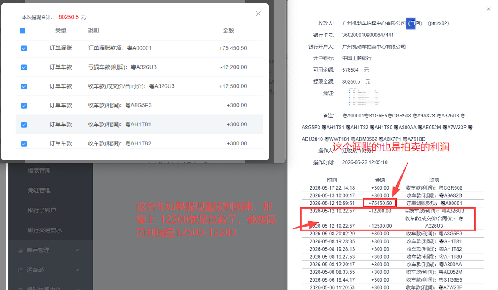

# 经营者与从业人员收入信息报送表 需求文档

| 项目 | 内容 |
| --- | --- |
| 需求名称 | FNC 钱包-报表管理-经营者与从业人员收入信息报送表 |
| 提出方 | 财务 |
| 合规依据 | 《互联网平台企业涉税信息报送规定》——经营者与从业人员收入信息报送表 |
| 落地位置 | FNC 财务系统 → 财务管理 → 报表管理 |
| 触发时机 | 每季度首月 1 日 00:00 自动生成上季度数据快照（4/1、7/1、10/1、1/1） |
| 文档版本 | v0.46 |
| 文档日期 | 2026-06-12 |

---

## 一、背景与目标

为满足《互联网平台企业涉税信息报送》合规要求，需在 FNC 财务系统-财务管理-报表管理中新增一张**经营者与从业人员收入信息报送表**，**按季度**对平台已实名认证的经营者收入数据进行汇总归档，供财务提供给税局报送。

报表需满足：
1. **完整覆盖**：覆盖所有已实名认证且认证类型为「企业」或「个体工商户」的经营者；
2. **数据准确**：金额口径、订单口径与税务报送要求一致；
3. **版本归档**：生成后形成季度快照，事后流水变动不影响已生成期间的数据；
4. **可导出**：支持按季度筛选、按经营者搜索，并按指定模板（含合并表头）导出 Excel。

---

## 二、报送对象（经营者范围）

### 2.1 入选条件
进入本报表的「经营者」需**同时满足**以下条件：
- **已实名认证**：实名认证状态 = 已通过；
- **认证主体类型**：企业 或 个体工商户（不含个人）；
- **证件号码**：取「统一社会信用代码」（旧称"组织机构代码"已统一并入统一社会信用代码，无需兼容历史口径）；
- **经营者范围**：卖家（含门店账户、车主账户，须为企业或个体工商户） + 服务商


### 2.2 不入选范围
- 未取得登记证照的用户；
- 实名认证主体类型为「个人」的用户；
- 未通过实名认证的用户。

### 2.3 零流水经营者处理
**已认证但当季度零流水的经营者，仍输出一行，所有金额/笔数字段填 0。**（已确认）

### 2.4 经营者角色
| 角色 | 定义 | 报表中体现 |
| --- | --- | --- |
| 买家 | 在平台购车的用户（含门店/车主） | 不进入报表 |
| 卖家 | 在平台售车的用户（门店和车主，卖家需是企业或个体工商户） | 销售收入相关列取数 |
| 服务商 | 撮合买卖双方交易的中间服务商、第三方衍生服务的合作商，以及指定服务商账户（固定名单） | 服务收入相关列取数 |

#### 角色识别口径（基于现有业务数据，不新增 `userRole` 字段）
- **不新增字段**：本次不在用户表新增 `userRole`，也不做存量服务商名单的收集与批量打标。卖家身份通过**合同甲乙方**识别，服务商身份通过订单与服务关系直接识别。
- **卖家识别**（按合同类型取值，合同截图见下方示例）：
  1. **委拍合同（二手车委托竞价协议）**：取合同中的**甲方**（甲方即原车主；乙方为平台，不计入卖家）；
  2. **收购（转让/置换）合同（二手车转让协议）**：取合同中的**甲方和乙方**（甲方是原车主，乙方是新车主）。
- **服务商识别**（涵盖以下三类）：
  1. **订单表中的"服务商"角色**：撮合买卖双方交易的中间服务商，收取服务佣金 —— 即**订单详情页的"服务商"账号**，或**门店配置（门店详情 · 业务相关）中的"服务商"账号**；
  2. **衍生服务订单 - 项目与服务商管理中的服务商**：在第三方服务下挂载的合作商（年检代办、提档代办、过户代办、铁牌费、改装修复、维修、保险等）；
  3. **指定服务商账户（固定名单）**：不在上述两类关系的自动识别范围内，按固定账户名单纳入 ——
     - **广州机动车拍卖中心有限公司**：**仅取账户 `pmzx02`**（该主体的其他账户不计入），取数口径见 §3.1 服务收入构成 ④；
     - **唯普云服务**：账户 `wpybmz`，取数口径见 §3.1 服务收入构成 ⑤。

#### 取值示例截图（开发参考）

**📷 卖家取值 · 合同 1：委拍合同（二手车委托竞价协议）→ 取甲方**


- 合同**甲方**（示例中"中山市广物君奥汽车销售服务有限公司"，标注"车主"）= **卖家**（原车主）；
- 乙方为平台（广东唯普汽车科技股份有限公司），不计入卖家。

**📷 卖家取值 · 合同 2：收购（转让/置换）合同（二手车转让协议）→ 取甲方 + 乙方**


- 合同**甲方**（示例中"李凌峰"，标注"车主"）= **原车主**，计入卖家；
- 合同**乙方**（示例中"佛山广物汇和汽车服务有限公司"，标注"门店"）= **新车主**，计入卖家。

**📷 示例 1：门店详情页（集团门店管理 → 门店详情 · 业务相关）— 服务商取值 1**


- 截图红框中「服务商」（如示例中"广州市悠悦汽车服务有限公司（服务商）`gzyyfw`"）= **服务商取值 1**（中间服务商）。

**📷 示例 2：服务中心 → 衍生服务订单 → 项目与服务商管理 — 服务商取值 2**


- 截图所示「服务合作商」列表（挂载在年检代办、提档代办、过户代办、铁牌费、改装修复、维修、保险 等第三方服务下）= **服务商取值 2**；
- 须为已认证的企业或个体工商户。

> 同一 `userName` 兼具卖家与服务商角色时，报表按「**合并为一行、销售+服务两栏并存**」设计：销售货物收入与销售服务收入分别落在对应栏位，无值的栏位填 0（详见 §四）。

---

## 三、金额口径

### 3.1 销售收入 / 服务收入
- **筛选条件**：销售收入侧状态 = **「已提现已清算」**；服务收入侧按 **「已提现（提现执行完毕）」** 口径（见下方服务收入构成）；
- **角色分流**：
  - 卖家身份产生的清算流水 → 计入「销售收入」；
  - 服务商身份产生的清算流水 → 计入「服务收入」；
  - 同一 `userName` 兼具两种身份时，在同一行内分别填入对应列。
- **服务收入构成**：`服务收入 包含 ① 汇和零售溢价（人工上传） + ② 中间服务商收入 + ③ 衍生服务商收入 + ④ 广州机拍（pmzx02）收入 + ⑤ 唯普云服务（wpybmz）收入`
  - **【服务收入一般取数口径，适用 ②③⑤】**（v0.44，v0.45 细化）：取账户**已提现（提现执行完毕）**流水中**款项不含「车款」字样且非负向（金额为正）**的明细汇总——与列 7 销售收入（取**款项等于「车款」**的明细）区分：列 7 取款项=「车款」、本口径取款项不含「车款」字样；二者对普通卖家/服务商账户互补不重叠，**含「车款」字样但不等于「车款」的特殊款项（如机拍「收车款（利润）」「亏损车款（利润）」）由 ④ 白名单单独处理、不在本口径**；① 汇和零售溢价走人工上传、④ 机拍 `pmzx02` 走款项白名单，均**不适用**本一般口径；
  - **① 汇和收益中的「衍生服务-零售溢价」**：由**汇和人工手动上传**（走 §8.2「汇和收入数据上传」通道，不再从汇和收益钱包流水自动取数，详见 §五）；
  - **② 中间服务商收入**（门店绑定的服务商账户，即订单清分时关联的服务商，对应 §2.4 服务商识别第 1 类）：按上方**服务收入一般取数口径**取数（已提现流水中**款项不含「车款」字样、非负向**的明细汇总）；
  - **③ 衍生服务商收入**（年检/提档/过户代办、铁牌费、改装修复、维修、保险等第三方衍生服务商在平台获得的服务费收入，对应 §2.4 第 2 类）：按上方**服务收入一般取数口径**取数（已提现流水中**款项不含「车款」字样、非负向**的明细汇总）；
  - **④ 广州机动车拍卖中心有限公司**（**仅取账户 `pmzx02`**，其他账户不计入；对应 §2.4 第 3 类）：机拍只有服务收入——服务收入 = 账户 `pmzx02` **已提现（提现执行完毕）**钱包流水中，按以下**款项类型（摘要）白名单**汇总求和（案例见附图 4）：
    - 摘要「**收车款（利润）**」：盈利车辆的常规入账，单笔即该车利润（附图 4 中每车 +300.00）；
    - 摘要「**订单调账款项**」：订单调账产生的款项，财务确认同属拍卖利润（附图 4：粤A00001 +75,450.50）；
    - 摘要「**收车款（成交价/合同价）**」＋「**亏损车款（利润）**」（**成对出现、轧差计入**）：亏损车辆不走单笔利润入账，而是同一车牌同时生成两笔流水——正数「收车款（成交价/合同价）」与负数「亏损车款（利润）」，两笔求和（轧差）后才是该车实际利润；这两笔通常**合并在同一笔提现**中执行，提现执行时间一致、归属同一统计周期（附图 4：粤A326U3 同时入账 +12,500.00 与 −12,200.00，实际利润 = 12,500 − 12,200 = **+300.00**）；**仅同一车牌两类摘要成对出现时纳入，未成对的单边流水不计入**（v0.29 确认）；
    - ⚠️ 取数注意：第 3 类需做**车牌配对校验**——同一车牌「收车款（成交价/合同价）」与「亏损车款（利润）」两类摘要齐备才成对纳入（轧差计入），**未成对的「收车款（成交价/合同价）」不计入**（否则会把整车价误计为收入）；负数「亏损车款（利润）」**必须计入**，不适用 ②③⑤ 的「剔除合并提现中提现为负数的款项」规则——若误剔除负数，上例将虚增 12,200；若沿用旧口径只取「收车款（利润）」，亏损车将漏计；
    - ⚠️ 退款金额（v0.39）：**机拍 `pmzx02` 服务退款按订单维度计算——列 11 = 统计周期内该账户售后「已退车」订单数 × 300**（机拍每车固定利润 300 元，退一车即退回该车利润，对应上方「收车款（利润）」每车 +300）；已退车订单数按**订单售后类型 =「已退车」**统计（订单表，车牌排重）；**退款订单数 = 售后已退车订单数**，同步作为列 13 的售后订单数（见 §4.1 规则 1）；仍不适用 §3.2 通用口径、不做「订单售后款项」流水匹配（机拍无该摘要流水）；原「不存在服务收入退款、列 11 固定填 0」（v0.35）下线；
  - **⑤ 唯普云服务**（账户 `wpybmz`；对应 §2.4 第 3 类）：按上方**服务收入一般取数口径**取数（已提现流水中**款项不含「车款」字样、非负向**的明细汇总）；退款金额同 §3.2 列 11 通用口径。

**📷 附图 4：广州机拍 pmzx02 · 合并提现勾选明细 + 提现详情（服务收入构成 ④ 案例，含财务批注）**



- 左图为**合并提现勾选明细**（本次提现合计 **80,250.50** 元），右图为该笔**提现详情的款项明细**（含财务批注），白名单三类构成齐全：
  - 盈利车常规入账：15 笔摘要「收车款（利润）」，每车 +300.00（合计 4,500.00）；
  - 订单调账款项：粤A00001 **+75,450.50**（财务批注：「这个调账的也是拍卖的利润」）；
  - 亏损车成对流水：粤A326U3 同一时刻（2026-05-12 10:22:57）入账 **+12,500.00**「收车款（成交价/合同价）」与 **−12,200.00**「亏损车款（利润）」，轧差 **+300.00** = 该车实际利润（财务批注：「这台车如果提现里按利润来，那 −12,200 就是负数了，实际利润是 12500 − 12200」），两笔**勾选合并在同一笔提现**中执行；
- 勾稽验证：80,250.50 = 75,450.50 ＋ (12,500 − 12,200) ＋ 15 × 300；
- 退款侧：**机拍 `pmzx02` 列 11 = 售后「已退车」订单数 × 300**（每车固定利润 300 元，退一车退回该车利润；退款订单数 = 售后已退车订单数，v0.39，见 §3.2 例外说明）。

### 3.1.1 销售货物收入（列 7）— 按门店垫款方式分四类场景

> **业务定义**：销售货物收入 = 卖家在统计周期内通过平台销售车辆所获得的收入（不含退款）。
> 因不同门店的垫款方式不同（汇和垫款 / 唯普云垫款 / 门店自垫款 / 非垫款），实际取数口径分以下四类：

| # | 适用场景 | 取数口径 | 案例 |
| --- | --- | --- | --- |
| 场景 1 | **非垫款车辆**（非汇和垫款、非唯普云垫款、非门店自垫款，按提现汇总） | 销售收入 = 统计周期内「已提现已清算」明细中**款项等于「车款」**的明细汇总（v0.45，原 v0.37『包含「车款」』下线）；<br>⚠️ **合并提现中如包含负向流水（如仲裁），需剔除** | 车牌 **湘AN172F**（附图1）：一次提现 30,000 元，明细含车款 **+34,800**、售后扣款 **−4,800**；<br>→ 销售收入 = **34,800**（剔除负向 −4,800） |
| 场景 2 | **门店使用「汇和垫款」**（汇和垫款的收购车） | **此部分数据不走系统自动取数，由汇和人工上传**：<br>系统提供**数据上传入口**，上传模板同报送表样式、不含「角色」列、首列增加「报表季度」（见 §8.2）。 | 车牌 **粤QG2630**（附图3）：<br>① 汇和垫款户 +23,000（收回垫付车款）<br>② 汇和收益 +2,600（车款·利润）<br>③ SaaS 服务费 −600<br>④ 本单无零售溢价<br>→ 销售收入 = **23,000 + 2,600 − 600 = 25,000** |
| 场景 3 | **门店自垫款**（取**门店自垫款账户**流水） | 销售收入 = 流水摘要「收车款（成交价）」或「收车款（成交价/合同价）」 + 流水摘要含「衍生服务-零售溢价-结算」或「衍生订单服务（零售溢价）」<br>⚠️ **零售溢价取「门店自垫款账户」的流水，不是「汇和收益账户」**（汇和收益账户的零售溢价按 §五 计入服务收入） | 车牌 **粤A1H2Y4**（附图2）：<br>+47,000（收车款·成交价）<br>+ 零售溢价金额<br>→ 销售收入 = 47,000 + 零售溢价 |
| 场景 4 | **唯普云垫款**（唯普云垫款的收购车） | 销售收入 = **唯普云垫款账户**（`wpydk`）摘要「收回垫付车款」的钱包流水 + **唯普云收益账户**（`wpuyunsy`）的**全部**钱包流水 | — |

> **说明**：四类场景按车辆的垫款方式互斥归类 —— 场景 1 覆盖无垫款的常规车辆；场景 2 仅对应汇和垫款车辆；场景 3 仅对应门店自垫款车辆；场景 4 仅对应唯普云垫款车辆。

#### 附图

**📷 附图 1：湘 AN172F · 提现弹窗（场景 1 案例）**


**📷 附图 2：粤 A1H2Y4 · 钱包流水（场景 3 案例）**


**📷 附图 3：粤 QG2630 · 钱包流水（场景 2 案例）**


---

### 3.2 退款金额（按官方模板拆为两栏）
按国税总局报送表，退款需按经营性质拆分为「销售货物退款」和「销售服务退款」两栏。

- **销售货物退款金额（对应列 8）**：
  - 取数来源：FNC-钱包流水；
  - 取数逻辑（v0.42）：统计周期内，匹配**卖家**账户钱包流水摘要包含「**订单售后款项**」，汇总求和（与列 11 通用口径一致）；原「卖家账户负向流水之和、剔除提现类型取绝对值」口径下线；
  - 归属期间：按**售后执行时间**归属当季度。
- **销售服务退款金额（对应列 11）**：
  - 取数来源：FNC-钱包流水；
  - 取数逻辑（**通用口径**）：统计周期内，匹配**服务商**账户钱包流水摘要包含「**订单售后款项**」，汇总求和（`pmzx02` 例外见下）；
  - ⚠️ **例外（v0.39）：广州机拍 `pmzx02` 按订单维度计算——列 11 = 统计周期内售后「已退车」订单数 × 300**（每车固定利润 300 元），**退款订单数 = 售后已退车订单数**（订单售后类型 =「已退车」，订单表，车牌排重）；不做「订单售后款项」流水匹配（机拍无该摘要流水）；原 v0.35「不存在服务收入退款、列 11 固定填 0」下线（见 §3.1 构成 ④）；
  - 归属期间：按**售后执行时间**归属当季度。

> ⚠️ **双角色账户的退款归属（v0.43）**：兼具卖家+服务商双角色的账户，因服务商角色基本不产生「订单售后款项」退款，该账户的退款（摘要含「订单售后款项」汇总）**统一计入列 8（销售货物退款）**，**列 11（销售服务退款）按 0 处理**，避免同一账户退款在列 8 / 列 11 两列重复计算；指定账户 `pmzx02`（纯服务商，列 11 = 已退车订单数 × 300 特殊口径，见 §3.1 构成 ④）不适用本条。

### 3.3 销售/服务收入与退款的勾稽
- 平台所有退款必须经过仲裁产生（业务规则）；
- 因此清算流水中包含的仲裁负数款项，需要：
  1. 从「销售货物收入总额 / 销售服务收入总额」中**剔除**（避免重复扣减）；
  2. **归集**到对应的退款列（列 8 / 列 11）。
- 公式表达：
  - `销售货物收入总额(列7)  = 卖家「已提现已清算」明细中款项等于「车款」的明细汇总 − 卖家「提现仲裁负数款项」`（v0.45）
  - `销售货物退款金额(列8)  = 卖家账户流水摘要含「订单售后款项」汇总求和（按售后执行时间归属当季度）`（v0.42）
  - `销售服务收入总额(列10) = 服务商「已提现（提现执行完毕）」流水汇总 − 服务商「提现仲裁负数款项」 + 汇和人工上传部分（①零售溢价等）`（④ 机拍 `pmzx02` 按款项类型白名单汇总，负数「亏损车款（利润）」参与轧差、不作剔除，见 §3.1 构成 ④）
  - `销售服务退款金额(列11) = 服务商账户流水摘要含「订单售后款项」汇总求和（按售后执行时间归属当季度）`（机拍 `pmzx02` 例外：列 11 = 售后「已退车」订单数 × 300，订单维度，v0.39）

### 3.4 收入净额（两个公式）
- **销售货物收入净额（列 9）**：`列9 = 列7 − 列8`；
- **销售服务收入净额（列 12）**：`列12 = 列10 − 列11`；
- 由报表生成时直接计算并落库，不依赖导出时再算。

---

## 四、交易笔数（订单数）

### 4.1 计数规则（按账户角色区分；计数单位 = 车牌，排重）
1. **账户仅为服务商账户**：`交易订单数量 = 提现车牌数 − 售后订单数`
   - 提现订单数：**提现摘要车牌排重汇总**（含「**订单调账款项**」摘要中的车牌，如附图 4 粤A00001——调账车牌计入提现车牌数，v0.29 确认）；
   - 售后订单数：摘要为【**订单售后款**】的流水**车牌排重汇总**；
   - ⚠️ 机拍 `pmzx02` 例外（v0.39）：该账户无摘要【订单售后款】流水，售后订单数（退款订单数）取**订单售后类型 =「已退车」的订单车牌排重汇总**（订单表，按**售后执行时间**归属当季度（v0.40 确认），与列 11 退款金额「已退车订单数 × 300」同源，见 §3.2 例外）。
2. **账户仅为卖方账户**（统一口径，汇和垫款除外）：`销售订单数 = 销售收入订单数 − 退款订单数`
   - 销售收入订单数：按**提现流水车牌排重汇总**；
   - 退款订单数：统计周期内，按**订单售后类型 =「已退车」**的订单**车牌排重汇总**（订单表售后类型字段；按**售后执行时间**归属当季度，v0.40 确认）；
   - **汇和垫款**：仍由**汇和单独人工上传**（随 §8.2 上传模板列 13）；
   - 原四场景细分（v0.21：非垫款 / 门店自垫款 / 唯普云垫款分别按提现或销售收入流水车牌计数、售后订单数按摘要【订单售后款】车牌排重）**下线**。

> ⚠️ **兼具卖家与服务商身份的账户**（v0.46 公式明确）：列 13 = **服务商侧订单数（服务收入订单数 − 服务收入退款订单数）＋ 卖方侧订单数（销售收入订单数 − 销售收入退款订单数）**，两侧（规则 1 + 规则 2）分别计算后求和合并填入。

### 4.2 模板填列
- 模板**只有 1 列**（销售 + 服务合并），同一 `userName` 的卖家身份订单数 + 服务商身份订单数合并填入。

---

## 五、汇和零售溢价

### 5.1 范围说明
- 「汇和的零售溢价进服务商收入」：
  - 实质汇和垫款的订单 → 算「销售收入」；
  - 非汇和垫款的订单 → 算「服务收入」；
  - 因汇和垫款的订单量太少，**统一按零售溢价计入服务商收入**。

### 5.2 零售溢价取数
- **取数方式（v0.15 起）**：由**汇和人工手动上传**（走 §8.2「汇和收入数据上传」通道），并入对应服务商（`userName`）的服务收入；
- 原「汇和收益钱包流水摘要包含『衍生服务-零售溢价-结算』、记在钱包转出账户」的自动聚合口径**下线**，仅留作上传数据的核对参考；
- ⚠️ **与 §3.1.1 场景 3 区分**：进入**门店自垫款账户**的零售溢价流水计入该门店的**销售收入**（场景 3），不在本节「汇和零售溢价 → 服务收入」口径内，两边账户不同、互不重复。

---

## 六、数据源

| 数据项 | 表 / 服务 | 备注 |
| --- | --- | --- |
| 卖家提现 + 清算流水 | FNC-钱包流水 | 状态 = 已提现已清算，列 7 取**款项等于「车款」**的明细汇总（v0.45；场景 2 汇和垫款部分除外，见下行） |
| 场景 2（汇和垫款）销售收入 | 汇和人工上传 | 数据上传入口（模板同报送表样式、不含「角色」列、首列「报表季度」，见 §8.2）；汇和**服务收入**亦走该上传通道 |
| 场景 3（门店自垫款）销售收入 | FNC-钱包流水（**门店自垫款账户**） | 摘要匹配见 §3.1.1 场景 3；零售溢价取门店自垫款账户、非汇和收益账户 |
| 场景 4（唯普云垫款）销售收入 | FNC-钱包流水（**唯普云垫款账户 `wpydk`** + **唯普云收益账户 `wpuyunsy`**） | 垫款账户取摘要「收回垫付车款」流水；收益账户取全部流水（见 §3.1.1 场景 4） |
| 服务商提现流水 | FNC-钱包流水 | 状态 = **已提现（提现执行完毕）**，②③⑤ 取**款项不含「车款」字样、非负向**明细汇总（列 7 取款项=「车款」；机拍含车款字样款项走白名单，v0.45）；④ 机拍 `pmzx02` 走款项白名单（见 §3.1 服务收入构成 ②③⑤/④） |
| 指定服务商账户（固定名单） | 固定配置 | 广州机动车拍卖中心有限公司**仅取账户 `pmzx02`**（按款项类型白名单汇总：「收车款（利润）」＋「订单调账款项」＋亏损车成对流水轧差，**仅成对纳入**）；唯普云服务 `wpybmz`（见 §2.4 第 3 类 / §3.1 构成 ④⑤） |
| 钱包流水（含仲裁标识、是否售后） | FNC-钱包流水 | 摘要含「订单售后款项」用于识别退款；**列 8（卖家）与列 11（服务商）通用口径一致 = 该账户摘要含「订单售后款项」流水汇总求和**，按售后执行时间归属当季度（列 8 v0.42 起改此口径，见 §3.2）；机拍 `pmzx02` 列 11 例外：售后「已退车」订单数 × 300（订单表，v0.39） |
| 交易笔数计数 | FNC-钱包流水 + 订单表 | 服务商侧：提现摘要 / 摘要【订单售后款】**车牌排重**（机拍 `pmzx02` 售后订单数取订单售后类型=「已退车」订单车牌排重，v0.39）；卖方侧（v0.38）：提现流水车牌排重 − 订单售后类型=「已退车」订单车牌排重；场景 2（汇和垫款）随汇和人工上传（见 §四） |
| 实名认证信息：`accountName`、统一社会信用代码、营业执照状态 | 用户表 | 报送主键信息 |
| 经营者角色识别（卖家/服务商） | 合同（委拍/收购） + 订单表 + 衍生服务订单（项目与服务商管理） + 指定账户名单 | 见 §2.4，**不新增** `userRole` 字段；卖家按合同甲乙方识别（委拍取甲方；收购取甲方+乙方），服务商依赖订单与衍生服务关系识别 + 指定账户固定名单（`pmzx02`、`wpybmz`） |

---

## 七、报表字段清单（输出模板）

依据国家税务总局《平台内的经营者收入报送信息表》官方模板（含三级合并表头）。

### 7.1 表头结构

```
┌────┬──────────┬──────────────────────┬──────────┬──────────┬──────────┬──────┬─────────────────────────────────────────────┬──────────┐
│序号│是否已取得│   已取得登记证照       │收入来源的│收入来源的│收入来源的│ 角色 │     已取得登记证照的平台内经营者收入信息       │交易(订单)│
│   │登记证照  ├──────────┬───────────┤互联网平台│店铺(用户)│店铺(用户)│      ├─────────────────────┬─────────────────────┤数量(笔) │
│   │          │ 名称     │统一社会信用│  名称   │  名称   │唯一标识码│      │ 销售货物取得的收入     │ 销售服务取得的收入     │         │
│   │          │ (姓名)   │代码(纳税人 │         │         │         │      ├─────┬─────┬─────┼─────┬─────┬─────┤         │
│   │          │          │识别号)    │         │         │         │      │收入 │退款 │收入 │收入 │退款 │收入 │         │
│   │          │          │           │         │         │         │      │总额 │金额 │净额 │总额 │金额 │净额 │         │
├────┼──────────┼──────────┼───────────┼──────────┼──────────┼──────────┼──────┼─────┼─────┼─────┼─────┼─────┼─────┼──────────┤
│ 序 │   1     │    2    │    3     │   4     │  5      │   6     │  *  │  7  │  8  │9=7-8│ 10 │ 11 │12=10-11│  13   │
└────┴──────────┴──────────┴───────────┴──────────┴──────────┴──────────┴──────┴─────┴─────┴─────┴─────┴─────┴─────┴──────────┘
```

### 7.2 字段清单

| 列号 | 字段 | 取值说明 | 数据源 |
| --- | --- | --- | --- |
| 序 | 序号 | 行号 | 自动生成 |
| 1 | 是否已取得登记证照 | 固定填「是」（本报表仅出已认证且为企业/个体工商户的主体） | — |
| 2 | 名称（姓名） | 实名主体名称（企业全称 / 个体工商户名称） | 用户表「开户名」`accountName` |
| 3 | 统一社会信用代码（纳税人识别号） | 实名认证信息 | 用户表 `creditCode` |
| 4 | 收入来源的互联网平台名称 | 固定值「唯普汽车」 | — |
| 5 | 收入来源的店铺（用户）名称 | 取「用户列表 · 姓名」字段 | 用户表 `trueName` |
| 6 | 收入来源的店铺（用户）唯一标识码 | 平台分配的唯一标识 | 用户表 `userName` |
| **\*** | **角色**（平台内部审计列） | 卖家 / 服务商 / 卖家+服务商 | 由合同、订单与衍生服务关系识别（见 §2.4） |
| 7 | 销售货物取得的收入 — 收入总额 | 见 §3.1（卖家口径） | FNC-钱包流水 + 场景 2 汇和人工上传数据 |
| 8 | 销售货物取得的收入 — 退款金额 | 见 §3.2：卖家账户流水摘要含「订单售后款项」汇总求和，按售后执行时间归属当季度（v0.42） | FNC-钱包流水 |
| 9 | 销售货物取得的收入 — 收入净额 | `列9 = 列7 − 列8` | 生成时落库 |
| 10 | 销售服务取得的收入 — 收入总额 | 见 §3.1 服务收入构成（五类：① 零售溢价人工上传 + ② 中间服务商 + ③ 衍生服务商 + ④ 机拍 `pmzx02` + ⑤ 唯普云 `wpybmz`）；②③⑤ 一般口径 = 已提现流水**款项不含「车款」字样、非负向**明细汇总（v0.45；列 7 取款项=「车款」） | FNC-钱包流水 + 汇和人工上传 |
| 11 | 销售服务取得的收入 — 退款金额 | 见 §3.2 通用口径：服务商账户流水摘要含「订单售后款项」汇总求和，按售后执行时间归属当季度；**机拍 `pmzx02` 例外：列 11 = 售后「已退车」订单数 × 300**（每车固定利润 300 元，v0.39） | FNC-钱包流水 + 订单表（机拍 `pmzx02` 已退车订单数） |
| 12 | 销售服务取得的收入 — 收入净额 | `列12 = 列10 − 列11` | 生成时落库 |
| 13 | 交易（订单）数量（笔） | 按账户角色计数（见 §四）：服务商 = `提现车牌数 − 售后订单数`（摘要【订单售后款】车牌排重；机拍 `pmzx02` 售后订单数取订单售后类型=「已退车」车牌排重，v0.39）；卖方 = `销售收入订单数 − 退款订单数`（提现流水车牌排重 − 订单售后类型=「已退车」车牌排重，v0.38）；汇和垫款随人工上传；卖家+服务商合并填一列 | FNC-钱包流水（提现摘要 / 摘要【订单售后款】车牌排重）+ 订单表（售后类型=已退车）+ 场景 2 汇和人工上传 |

### 7.3 "角色"列说明（带 * 标记）

- **角色**列为平台内部审计列，**非国税总局官方报送列**；
- **用途**：方便财务/审计同事快速识别 `userName` 对应主体的业务身份（卖家 / 服务商 / 卖家+服务商），校验列 7~12 的取数是否正确；
- **导出 Excel** 时固定一并输出该列，**不提供「勾选是否输出」选项**（原「支持勾选是否输出」口径下线，v0.36）；报送税局前由财务自行去掉该审计列（去掉后即为官方模板）。

---

## 八、报表生成与展示机制

### 8.1 生成机制
- **频率**：每季度 1 次（一年 4 次）；
- **时机**：每季度结束后**首月 1 日 00:00**（季初零点）自动触发，即 **4/1、7/1、10/1、1/1**；
- **数据范围**：上一个自然季度。例：
  - 4/1 生成 → 覆盖 Q1：1/1 00:00 至 3/31 23:59:59；
  - 7/1 生成 → 覆盖 Q2：4/1 00:00 至 6/30 23:59:59；
  - 10/1 生成 → 覆盖 Q3：7/1 00:00 至 9/30 23:59:59；
  - 1/1 生成 → 覆盖 Q4：10/1 00:00 至 12/31 23:59:59。
- **初始化**：**功能上线后，需初始化 2026 年 1-3 月（2026 Q1）的数据**，作为首期报表数据，初始化完成后由季度调度自动接管；
- **版本归档**：**生成即锁定快照**，已生成期间的报表数据不再随事后流水变动而变化（已确认）；
  - 实现方式建议：生成时将聚合结果归档（如 `t_fnc_report_operator_income_quarterly`），后续查询/导出直接读归档表；
  - 数据回溯：若需对历史季度重算（如发现数据问题），需走特殊审批流程并保留重算记录。

### 8.2 列表展示（FNC-钱包-报表管理）
- **入口**：FNC → 钱包 → 报表管理 → 新增"经营者与从业人员收入信息报送表"模块；
- **列表功能**：
  - 季度筛选（必选，默认当前已生成的最新季度）；
  - 经营者搜索（按 `accountName` / `userName` / 统一社会信用代码模糊匹配）；
  - 列表浏览（分页）；
- **汇和收入数据上传**：
  - 「汇和」**销售收入和服务收入**不走系统自动取数，由**汇和人工上传**，上传后并落入对应经营者的数据中（销售收入侧见 §3.1.1 场景 2）；
  - 列表页提供「**上传汇和收入**」按钮（数据上传入口）；
  - 上传模板：**同报送表样式，但不含「角色」审计列，首列增加「报表季度」**（即报表季度 + 列 1-6 + 列 7-13），弹窗内支持下载 **Excel 预填模板 `汇和收入数据上传模板.xlsx`**：首列「**报表季度**」（如 `2026Q1`）与**列 1-6 经营者基础信息已预填**（汇和主体「佛山广物汇和汽车服务有限公司」`huihedk`），由汇和补充——① **收入**（列 7/10）、② **退款**（列 8/11）、③ **其他相关数据**（收入净额列 9/12、交易笔数列 13）；
  - **上传流程**：选择文件 → **确认上传**（系统解析并展示本次上传数据明细：文件名、行数、内容预览，供上传人核对）→ **确认导入** → 提示「**导入成功**」，数据按列对应并入经营者的销售 / 服务收入各列；
  - **导入数据的季度归属**：按模板首列「**报表季度**」取值归属对应季度报表，**与页面当前筛选季度无关**；缺「报表季度」或「店铺（用户）唯一标识码」的行视为无效行，不予导入并在导入结果中提示；
  - **权限控制**：「上传汇和收入」按钮为**独立权限点，需单独开通**（默认不开放，不随报表查看权限下发），仅授予汇和上传账号；
  - **数据可见性（数据隔离，查看 + 导出）**：汇和上传账号在本报表页**仅能查看自己导入的数据**，平台其他经营者数据不可见；**导出同样受限——仅能导出本账号已上传（导入）的数据**；平台管理员可见并可导出全量数据（含汇和导入部分）；
- **辅助说明**：
  - 关键列（如「销售收入」「服务收入」「退款金额」）旁放置 ❓ 图标，鼠标悬停弹框告知具体取值逻辑；
  - 弹框文案以本文档 §三~§五 内容为基础。

### 8.3 导出
- 导出格式：Excel；
- 导出模板：按上图模板带合并表头；
- 导出范围：当前筛选条件下的全部数据（不分页）；
- **权限控制**：「导出」按钮为**独立权限点，需单独配置开通**（不随报表查看权限默认下发），未开通权限的账号不展示该按钮；
- **导出数据范围跟随账号数据权限**：平台管理员可导出全量数据（含汇和导入部分）；汇和上传账号**仅能导出本账号已上传（导入）的数据**（见 §8.2 数据隔离）。

---

## 九、附：取数 SQL 思路示意（仅供研发参考）

```text
-- 季度聚合伪代码（基于订单关系直接识别卖家/服务商，无 userRole 字段）
WITH base_users AS (
    -- 候选报送对象：已认证企业/个体工商户
    SELECT userName, accountName, 统一社会信用代码, 营业执照状态
    FROM 用户表
    WHERE 实名认证状态 = '已通过'
      AND 认证主体类型 IN ('企业', '个体工商户')
),
seller_set AS (
    -- 卖家：按合同类型识别 —— 委拍合同取甲方（原车主）；收购（转让/置换）合同取甲方+乙方（原车主+新车主）
    SELECT DISTINCT 甲方userName AS userName
    FROM 合同表                                   -- 委拍 + 收购合同的甲方均为卖家
    WHERE 业务季度 = :report_quarter
    UNION
    SELECT DISTINCT 乙方userName AS userName
    FROM 合同表
    WHERE 合同类型 IN ('收购-转让', '收购-置换')    -- 仅收购合同追加乙方（新车主）；委拍乙方为平台，不计入
      AND 业务季度 = :report_quarter
),
provider_set AS (
    -- 服务商：订单表中的"服务商"角色 + 衍生服务订单中的合作服务商 + 指定账户固定名单
    SELECT DISTINCT 服务商userName AS userName FROM 订单表 WHERE 业务季度 = :report_quarter
    UNION
    SELECT DISTINCT 服务商userName AS userName FROM 衍生服务订单 WHERE 业务季度 = :report_quarter
    UNION
    SELECT userName FROM 指定服务商账户名单
    -- 固定名单：'pmzx02'（广州机动车拍卖中心有限公司，仅取此账户，其他账户不计入）、'wpybmz'（唯普云服务）
),
seller_flow AS (
    -- 卖家身份的清算流水（按收款方为卖家账户聚合）
    -- 列 7 一般口径（v0.45）：款项类型 = 「车款」的明细汇总（精确匹配，原 v0.37『包含车款 LIKE』下线），剔除合并提现中负向流水（如仲裁）；场景 3/4 特殊摘要口径见 §3.1.1
    -- 列 8 退款（v0.42）：卖家账户摘要含「订单售后款项」流水汇总求和（与列 11 通用口径一致），按售后执行时间归属当季度；原「负向流水剔提现取绝对值」下线
    SELECT userName,
           SUM(CASE WHEN 款项类型 = '车款' AND 金额 > 0 THEN 金额 ELSE 0 END) AS 正向流水,  -- 列7：款项=车款（精确，v0.45）
           SUM(CASE WHEN 摘要 LIKE '%订单售后款项%' THEN ABS(金额) ELSE 0 END) AS 退款流水
    FROM FNC_钱包流水
    WHERE 状态 = '已提现已清算' AND 清算季度 = :report_quarter
      AND userName IN (SELECT userName FROM seller_set)
    GROUP BY userName
),
provider_flow AS (
    -- 服务收入：②③⑤ 按「已提现(提现执行完毕)」流水中『款项不含「车款」字样、非负向(金额>0)』明细汇总（列7取款项=车款，v0.45）；④ 机拍 pmzx02 按款项类型白名单汇总（含「收车款（利润）」等含车款摘要，单独处理）：
    --   摘要「收车款（利润）」+「订单调账款项」+ 亏损车成对流水「收车款（成交价/合同价）」+「亏损车款（利润）」
    --   （需按车牌配对校验：两类摘要齐备才成对纳入轧差，未成对的「收车款（成交价/合同价）」不计入；负数不剔；此处为示意，细分口径见 §3.1 构成 ④）
    -- 列 11 退款（通用口径）：摘要含「订单售后款项」汇总求和，按售后执行时间归属当季度（wpybmz 适用；pmzx02 例外：列 11 = 订单售后类型「已退车」订单数 × 300，需关联订单表统计、不走流水匹配，v0.39；此处与收入侧合并示意，归属时间字段以 DBA 确认为准）
    SELECT userName,
           SUM(CASE WHEN 摘要 NOT LIKE '%车款%' AND 摘要 NOT LIKE '%订单售后款项%' AND 金额 > 0 THEN 金额 ELSE 0 END) AS 正向流水,  -- ②③⑤：非车款、非负向（④机拍白名单见上方注释、需单独处理）
           SUM(CASE WHEN 摘要 LIKE '%订单售后款项%' AND 金额 < 0 THEN ABS(金额) ELSE 0 END) AS 退款流水
    FROM FNC_钱包流水
    WHERE 状态 = '已提现(提现执行完毕)' AND 提现季度 = :report_quarter
      AND userName IN (SELECT userName FROM provider_set)
    GROUP BY userName
),
-- premium_flow（汇和零售溢价自动聚合）已下线（v0.15）：零售溢价改由汇和人工上传，生成报表时并入对应服务商的服务收入
order_count AS (
    -- 交易笔数（见 §四）：计数单位 = 车牌（排重）
    -- 服务商：提现摘要车牌排重 − 摘要【订单售后款】车牌排重（提现摘要车牌含「订单调账款项」车牌，v0.29；机拍 pmzx02 售后订单数改取订单表「售后类型=已退车」车牌排重，v0.39）
    -- 卖方（统一口径 v0.38）：提现流水车牌排重 − 订单表「售后类型=已退车」订单车牌排重（原四场景细分下线；已退车订单数需关联订单表统计，此处示意）
    -- 汇和垫款：随汇和人工上传，不在此聚合
    SELECT userName,
           COUNT(DISTINCT CASE WHEN 流水类型='提现' THEN 摘要车牌 END)           AS 提现车牌数,
           COUNT(DISTINCT CASE WHEN 摘要 LIKE '%订单售后款%' THEN 摘要车牌 END)  AS 售后订单数
    FROM FNC_钱包流水
    WHERE 业务季度 = :report_quarter
    GROUP BY userName
)
SELECT
    u.accountName, u.统一社会信用代码, u.营业执照状态, u.userName,
    COALESCE(sf.正向流水, 0)                                AS 销售货物收入总额,
    COALESCE(sf.退款流水, 0)                                AS 销售货物退款金额,
    COALESCE(pf.正向流水, 0)                                AS 销售服务收入总额,  -- 汇和人工上传部分（①零售溢价等）生成时并入
    COALESCE(pf.退款流水, 0)                                AS 销售服务退款金额,
    (COALESCE(o.提现车牌数,0) - COALESCE(o.售后订单数,0))     AS 净订单数  -- 服务商侧减摘要【订单售后款】车牌数；卖方侧减订单表「已退车」订单车牌数（v0.38，示意）
FROM base_users u
LEFT JOIN seller_flow   sf ON sf.userName = u.userName
LEFT JOIN provider_flow pf ON pf.userName = u.userName
LEFT JOIN order_count   o  ON o.userName  = u.userName
WHERE u.userName IN (SELECT userName FROM seller_set)
   OR u.userName IN (SELECT userName FROM provider_set)
ORDER BY u.accountName;
```

> 上述 SQL 仅为口径示意，实际字段名/表名以 DBA 提供为准。卖家身份由合同甲乙方识别（委拍取甲方；收购取甲方+乙方），服务商身份由订单与衍生服务订单关系识别 + 指定账户固定名单（`pmzx02`、`wpybmz`），本次不在用户表新增角色字段，也不做存量服务商批量打标。
>
> ⚠️ **场景 2（汇和垫款）不走上述流水自动聚合**：该部分销售收入由汇和人工上传（见 §3.1.1 场景 2、§8.2），生成报表时需将上传数据并入对应经营者的列 7。
>
> ⚠️ **场景 4（唯普云垫款）**：取**唯普云垫款账户 `wpydk`**（摘要「收回垫付车款」）与**唯普云收益账户 `wpuyunsy`**（全部流水）聚合，并入列 7（见 §3.1.1 场景 4）。
