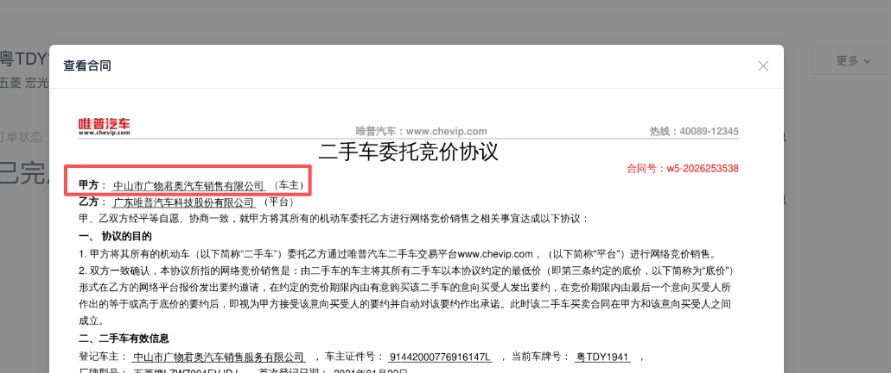
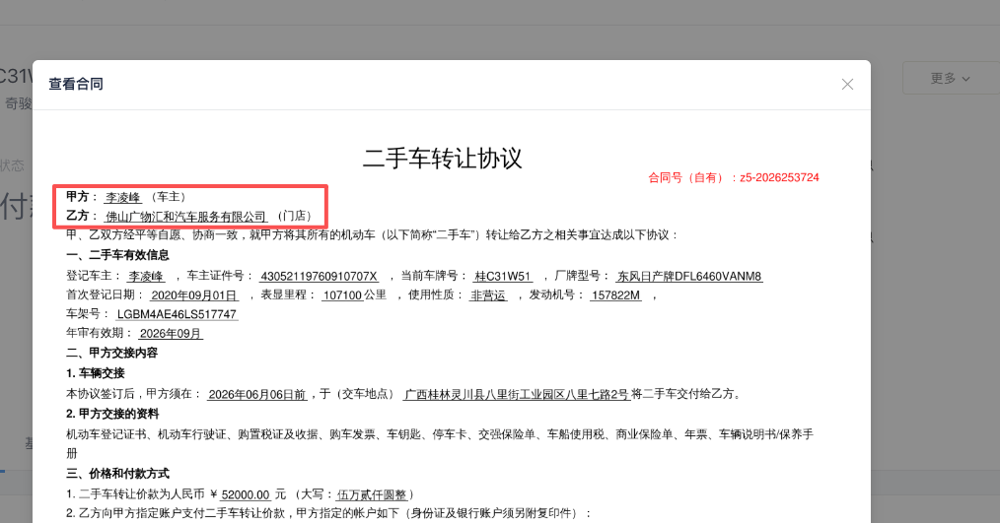
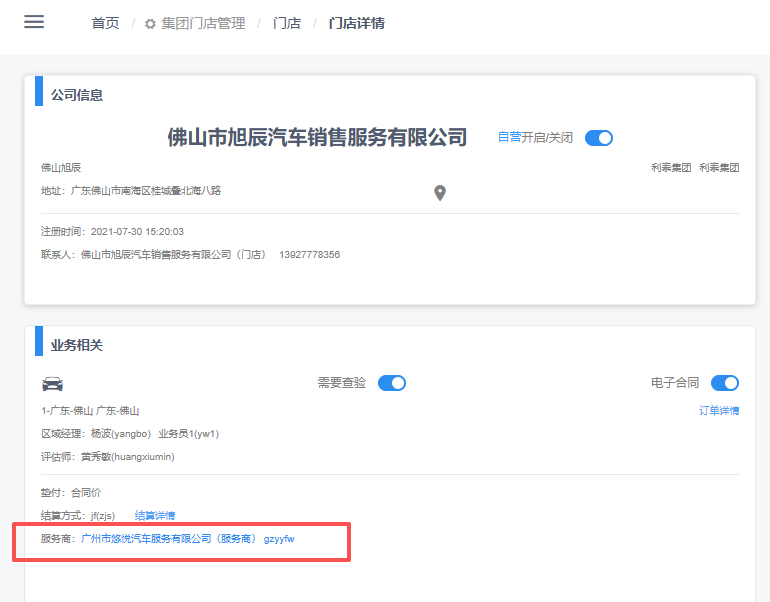
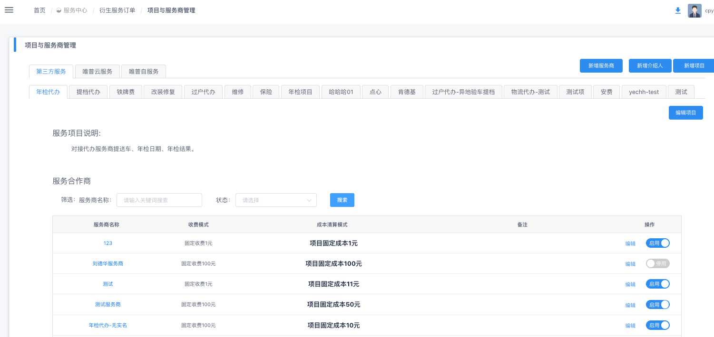
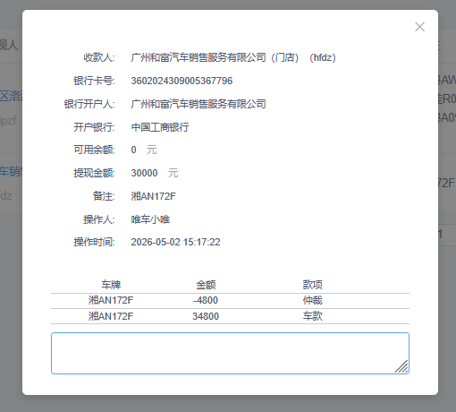
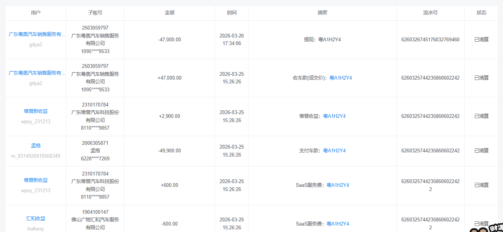
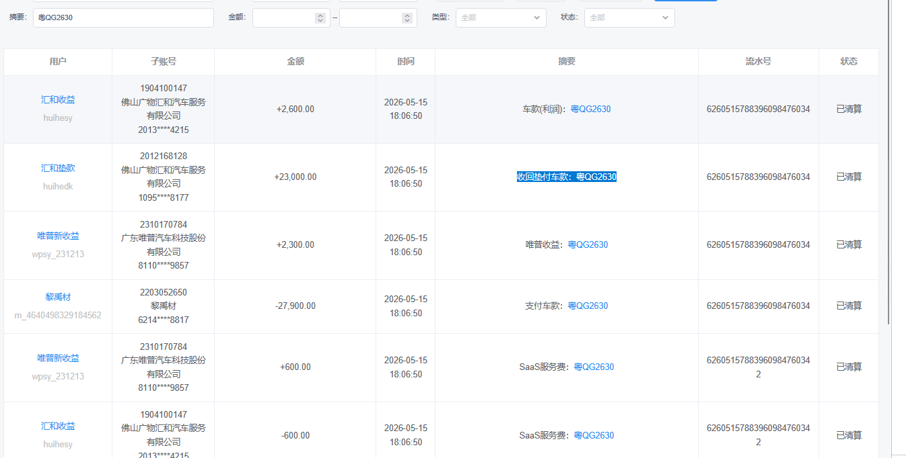

# 经营者与从业人员收入信息报送表 需求文档

| 项目 | 内容 |
| --- | --- |
| 需求名称 | FNC 钱包-报表管理-经营者与从业人员收入信息报送表 |
| 提出方 | 财务 |
| 合规依据 | 《互联网平台企业涉税信息报送规定》——经营者与从业人员收入信息报送表 |
| 落地位置 | FNC 财务系统 → 财务管理 → 报表管理 |
| 触发时机 | 每季度首月 1 日 00:00 自动生成上季度数据快照（4/1、7/1、10/1、1/1） |
| 文档版本 | v0.10 |
| 文档日期 | 2026-06-10 |

---

## 一、背景与目标

为满足《互联网平台企业涉税信息报送》合规要求，需在 FNC 财务系统-财务管理-报表管理中新增一张**经营者与从业人员收入信息报送表**，**按季度**对平台已实名认证的经营者收入数据进行汇总归档，供财务提供给税局报送。

报表需满足：
1. **完整覆盖**：覆盖所有已实名认证且认证类型为「企业」或「个体工商户」的经营者；
2. **数据准确**：金额口径、订单口径与税务报送要求一致；
3. **版本归档**：生成后形成季度快照，事后流水变动不影响已生成期间的数据；
4. **可导出**：支持按季度筛选、按经营者搜索，并按指定模板（含合并表头）导出 Excel。

---

## 二、报送对象（经营者范围）

### 2.1 入选条件
进入本报表的「经营者」需**同时满足**以下条件：
- **已实名认证**：实名认证状态 = 已通过；
- **认证主体类型**：企业 或 个体工商户（不含个人）；
- **证件号码**：取「统一社会信用代码」（旧称"组织机构代码"已统一并入统一社会信用代码，无需兼容历史口径）；
- **经营者范围**：卖家（含门店账户、车主账户，须为企业或个体工商户） + 服务商


### 2.2 不入选范围
- 未取得登记证照的用户；
- 实名认证主体类型为「个人」的用户；
- 未通过实名认证的用户。

### 2.3 零流水经营者处理
**已认证但当季度零流水的经营者，仍输出一行，所有金额/笔数字段填 0。**（已确认）

### 2.4 经营者角色
| 角色 | 定义 | 报表中体现 |
| --- | --- | --- |
| 买家 | 在平台购车的用户（含门店/车主） | 不进入报表 |
| 卖家 | 在平台售车的用户（门店和车主，卖家需是企业或个体工商户） | 销售收入相关列取数 |
| 服务商 | 撮合买卖双方交易的中间服务商、第三方衍生服务的合作商，以及指定服务商账户（固定名单） | 服务收入相关列取数 |

#### 角色识别口径（基于现有业务数据，不新增 `userRole` 字段）
- **不新增字段**：本次不在用户表新增 `userRole`，也不做存量服务商名单的收集与批量打标。卖家身份通过**合同甲乙方**识别，服务商身份通过订单与服务关系直接识别。
- **卖家识别**（按合同类型取值，合同截图见下方示例）：
  1. **委拍合同（二手车委托竞价协议）**：取合同中的**甲方**（甲方即原车主；乙方为平台，不计入卖家）；
  2. **收购（转让/置换）合同（二手车转让协议）**：取合同中的**甲方和乙方**（甲方是原车主，乙方是新车主）。
- **服务商识别**（涵盖以下三类）：
  1. **订单表中的"服务商"角色**：撮合买卖双方交易的中间服务商（如订单详情页中的"服务商"账户，收取服务佣金）；
  2. **衍生服务订单 - 项目与服务商管理中的服务商**：在第三方服务下挂载的合作商（年检代办、提档代办、过户代办、铁牌费、改装修复、维修、保险等）；
  3. **指定服务商账户（固定名单）**：不在上述两类关系的自动识别范围内，按固定账户名单纳入 ——
     - **广州机动车拍卖中心有限公司**：**仅取账户 `pmzx02`**（该主体的其他账户不计入）；
     - **唯普云服务**：登录用户名 `wpyunsy`。

#### 取值示例截图（开发参考）

**📷 卖家取值 · 合同 1：委拍合同（二手车委托竞价协议）→ 取甲方**



- 合同**甲方**（示例中"中山市广物君奥汽车销售服务有限公司"，标注"车主"）= **卖家**（原车主）；
- 乙方为平台（广东唯普汽车科技股份有限公司），不计入卖家。

**📷 卖家取值 · 合同 2：收购（转让/置换）合同（二手车转让协议）→ 取甲方 + 乙方**



- 合同**甲方**（示例中"李凌峰"，标注"车主"）= **原车主**，计入卖家；
- 合同**乙方**（示例中"佛山广物汇和汽车服务有限公司"，标注"门店"）= **新车主**，计入卖家。

**📷 示例 1：门店详情页（集团门店管理 → 门店详情 · 业务相关）— 服务商取值 1**



- 截图红框中「服务商」（如示例中"广州市悠悦汽车服务有限公司（服务商）`gzyyfw`"）= **服务商取值 1**（中间服务商）。

**📷 示例 2：服务中心 → 衍生服务订单 → 项目与服务商管理 — 服务商取值 2**



- 截图所示「服务合作商」列表（挂载在年检代办、提档代办、过户代办、铁牌费、改装修复、维修、保险 等第三方服务下）= **服务商取值 2**；
- 须为已认证的企业或个体工商户。

> 同一 `userName` 兼具卖家与服务商角色时，报表按「**合并为一行、销售+服务两栏并存**」设计：销售货物收入与销售服务收入分别落在对应栏位，无值的栏位填 0（详见 §四）。

---

## 三、金额口径

### 3.1 销售收入 / 服务收入
- **筛选条件**：状态 = **「已提现已清算」**；
- **角色分流**：
  - 卖家身份产生的清算流水 → 计入「销售收入」；
  - 服务商身份产生的清算流水 → 计入「服务收入」；
  - 同一 `userName` 兼具两种身份时，在同一行内分别填入对应列。
- **服务收入构成**：`服务收入 = ① 汇和收益的「衍生服务-零售溢价」 + ② 服务商的收入（衍生服务商 + 中间服务商） + ③ 指定服务商账户的收入（固定名单）`
  - **① 汇和零售溢价**：汇和收益钱包流水中摘要含「衍生服务-零售溢价-结算」的流水，记在「钱包转出账户」对应 `userName`（服务商）下（详见 §五）；
  - **② 衍生服务商收入**：年检/提档/过户代办、铁牌费、改装修复、维修、保险等第三方衍生服务商在平台获得的服务费收入（对应 §2.4 服务商识别第 2 类）；
  - **② 中间服务商收入**：订单清分时关联的中间服务商（订单表中撮合买卖双方交易、收取撮合佣金的"服务商"角色）的服务费收入（对应 §2.4 服务商识别第 1 类）；
  - **③ 指定服务商账户收入**：按固定账户名单纳入（对应 §2.4 服务商识别第 3 类）—— **广州机动车拍卖中心有限公司**（**仅取账户 `pmzx02`**，其他账户不计入）、**唯普云服务**（登录用户名 `wpyunsy`），取数口径与其他服务商一致（「已提现已清算」流水按清算季度归集）。

### 3.1.1 销售货物收入（列 7）— 按门店垫款方式分三类场景

> **业务定义**：销售货物收入 = 卖家在统计周期内通过平台销售车辆所获得的收入（不含退款）。
> 因不同门店的垫款方式不同（汇和垫款 / 门店自垫款 / 非垫款），实际取数口径分以下三类：

| # | 适用场景 | 取数口径 | 案例 |
| --- | --- | --- | --- |
| 场景 1 | **非汇和垫款车辆** + **非门店自垫款车辆**（按提现汇总） | 销售收入 = 统计周期内「已提现已清算」流水汇总；<br>⚠️ **合并提现中如包含负向流水（如售后扣款），需剔除** | 车牌 **湘AN172F**（附图1）：一次提现 30,000 元，明细含车款 **+34,800**、售后扣款 **−4,800**；<br>→ 销售收入 = **34,800**（剔除负向 −4,800） |
| 场景 2 | **门店使用「汇和垫款」**（汇和垫款的收购车） | **此部分数据不走系统自动取数，由汇和人工上传**：<br>① 系统提供**数据上传入口**，上传模板同当天的 Excel 表格；<br>② 备选：线下人工提供给国萍姐。<br>（参考口径——上传数据的计算逻辑：销售收入 = 汇和垫款户「收回垫付车款」流水 + 汇和收益流水 − SaaS 服务费 − 零售溢价） | 车牌 **粤QG2630**（附图3）：<br>① 汇和垫款户 +23,000（收回垫付车款）<br>② 汇和收益 +2,600（车款·利润）<br>③ SaaS 服务费 −600<br>④ 本单无零售溢价<br>→ 销售收入 = **23,000 + 2,600 − 600 = 25,000** |
| 场景 3 | **门店自垫款**（取**门店自垫款账户**流水） | 销售收入 = 流水摘要「收车款（成交价）」或「收车款（成交价/合同价）」 + 流水摘要含「衍生服务-零售溢价-结算」或「衍生订单服务（零售溢价）」<br>⚠️ **零售溢价取「门店自垫款账户」的流水，不是「汇和收益账户」**（汇和收益账户的零售溢价按 §五 计入服务收入） | 车牌 **粤A1H2Y4**（附图2）：<br>+47,000（收车款·成交价）<br>+ 零售溢价金额<br>→ 销售收入 = 47,000 + 零售溢价 |

> **说明**：三类场景按车辆的垫款方式互斥归类 —— 场景 1 覆盖既非汇和垫款也非门店自垫款的常规车辆；场景 2 仅对应汇和垫款车辆；场景 3 仅对应门店自垫款车辆。

#### 附图

**📷 附图 1：湘 AN172F · 提现弹窗（场景 1 案例）**



**📷 附图 2：粤 A1H2Y4 · 钱包流水（场景 3 案例）**



**📷 附图 3：粤 QG2630 · 钱包流水（场景 2 案例）**



---

### 3.2 退款金额（按官方模板拆为两栏）
按国税总局报送表，退款需按经营性质拆分为「销售货物退款」和「销售服务退款」两栏。

- **销售货物退款金额（对应列 8）**：
  - 取数来源：FNC-钱包流水；
  - 取数逻辑：统计周期内，**卖家**账户负向流水之和，剔除提现类型的负向流水后取绝对值；
  - 归属期间：按售后执行时间归属当季度。
- **销售服务退款金额（对应列 11）**：
  - 取数来源：FNC-钱包流水；
  - 取数逻辑：统计周期内，**服务商**账户负向流水之和，剔除提现类型的负向流水后取绝对值；
  - 归属期间：按售后执行时间归属当季度。

### 3.3 销售/服务收入与退款的勾稽
- 平台所有退款必须经过仲裁产生（业务规则）；
- 因此清算流水中包含的仲裁负数款项，需要：
  1. 从「销售货物收入总额 / 销售服务收入总额」中**剔除**（避免重复扣减）；
  2. **归集**到对应的退款列（列 8 / 列 11）。
- 公式表达：
  - `销售货物收入总额(列7)  = 卖家「已提现已清算」流水汇总  − 卖家「提现仲裁负数款项」`
  - `销售货物退款金额(列8)  = |卖家账户负向流水之和（剔除提现类型）|`
  - `销售服务收入总额(列10) = 服务商「已提现已清算」流水汇总 − 服务商「提现仲裁负数款项」`
  - `销售服务退款金额(列11) = |服务商账户负向流水之和（剔除提现类型）|`

### 3.4 收入净额（两个公式）
- **销售货物收入净额（列 9）**：`列9 = 列7 − 列8`；
- **销售服务收入净额（列 12）**：`列12 = 列10 − 列11`；
- 由报表生成时直接计算并落库，不依赖导出时再算。

---

## 四、交易笔数（订单数）

### 4.1 字段定义
- **提现订单数**：在统计周期内**完成提现结算**的订单维度计数（按提现任务清算完成时间归集；跨季场景——如提现日在上季度、清算结算执行在当季度——计入**当季度**，与 §3.1 金额口径保持一致）；同一订单分多次提现按 **1 单** 计；
- **退车订单数**：订单发生售后仲裁、需要退车的订单数；针对卖家侧和服务商侧（卖家退车时，服务商收到的佣金也需退回）。

### 4.2 净订单数
- 模板交易数量列：`净订单数 = 提现订单数 − 退车订单数`；
- 模板**只有 1 列**（销售 + 服务合并），即同一 `userName` 的卖家身份订单数 + 服务商身份订单数合并填入。

---

## 五、汇和零售溢价

### 5.1 范围说明
- 「汇和的零售溢价进服务商收入」：
  - 实质汇和垫款的订单 → 算「销售收入」；
  - 非汇和垫款的订单 → 算「服务收入」；
  - 因汇和垫款的订单量太少，**统一按零售溢价计入服务商收入**。

### 5.2 零售溢价取数
- 来源：汇和收益钱包流水；
- 筛选条件：摘要包含 **「衍生服务-零售溢价-结算」**；
- 这笔溢价记在「钱包转出账户名」对应的 `userName` 下（即服务商账户）。
- ⚠️ **与 §3.1.1 场景 3 区分**：进入**门店自垫款账户**的零售溢价流水计入该门店的**销售收入**（场景 3），不在本节「汇和收益账户 → 服务收入」口径内，两边账户不同、互不重复。

---

## 六、数据源

| 数据项 | 表 / 服务 | 备注 |
| --- | --- | --- |
| 卖家提现 + 清算流水 | FNC-钱包流水 | 状态 = 已提现已清算（场景 2 汇和垫款部分除外，见下行） |
| 场景 2（汇和垫款）销售收入 | 汇和人工上传 | 数据上传入口（模板同当天的 Excel 表格）；备选：线下提供给国萍姐 |
| 场景 3（门店自垫款）销售收入 | FNC-钱包流水（**门店自垫款账户**） | 摘要匹配见 §3.1.1 场景 3；零售溢价取门店自垫款账户、非汇和收益账户 |
| 服务商提现 + 清算流水 | FNC-钱包流水 | 状态 = 已提现已清算 |
| 指定服务商账户（固定名单） | 固定配置 | 广州机动车拍卖中心有限公司**仅取账户 `pmzx02`**；唯普云服务 `wpyunsy`（见 §2.4 第 3 类 / §3.1 ③） |
| 钱包流水（含仲裁标识、是否售后） | FNC-钱包流水 | 摘要含「订单售后款项」用于识别退款 |
| 订单信息（含「售后退车」状态字段） | 订单表 | 用于退车订单数统计 |
| 实名认证信息：`accountName`、统一社会信用代码、营业执照状态 | 用户表 | 报送主键信息 |
| 经营者角色识别（卖家/服务商） | 合同（委拍/收购） + 订单表 + 衍生服务订单（项目与服务商管理） + 指定账户名单 | 见 §2.4，**不新增** `userRole` 字段；卖家按合同甲乙方识别（委拍取甲方；收购取甲方+乙方），服务商依赖订单与衍生服务关系识别 + 指定账户固定名单（`pmzx02`、`wpyunsy`） |

---

## 七、报表字段清单（输出模板）

依据国家税务总局《平台内的经营者收入报送信息表》官方模板（含三级合并表头）。

### 7.1 表头结构

```
┌────┬──────────┬──────────────────────┬──────────┬──────────┬──────────┬──────┬─────────────────────────────────────────────┬──────────┐
│序号│是否已取得│   已取得登记证照       │收入来源的│收入来源的│收入来源的│ 角色 │     已取得登记证照的平台内经营者收入信息       │交易(订单)│
│   │登记证照  ├──────────┬───────────┤互联网平台│店铺(用户)│店铺(用户)│      ├─────────────────────┬─────────────────────┤数量(笔) │
│   │          │ 名称     │统一社会信用│  名称   │  名称   │唯一标识码│      │ 销售货物取得的收入     │ 销售服务取得的收入     │         │
│   │          │ (姓名)   │代码(纳税人 │         │         │         │      ├─────┬─────┬─────┼─────┬─────┬─────┤         │
│   │          │          │识别号)    │         │         │         │      │收入 │退款 │收入 │收入 │退款 │收入 │         │
│   │          │          │           │         │         │         │      │总额 │金额 │净额 │总额 │金额 │净额 │         │
├────┼──────────┼──────────┼───────────┼──────────┼──────────┼──────────┼──────┼─────┼─────┼─────┼─────┼─────┼─────┼──────────┤
│ 序 │   1     │    2    │    3     │   4     │  5      │   6     │  *  │  7  │  8  │9=7-8│ 10 │ 11 │12=10-11│  13   │
└────┴──────────┴──────────┴───────────┴──────────┴──────────┴──────────┴──────┴─────┴─────┴─────┴─────┴─────┴─────┴──────────┘
```

### 7.2 字段清单

| 列号 | 字段 | 取值说明 | 数据源 |
| --- | --- | --- | --- |
| 序 | 序号 | 行号 | 自动生成 |
| 1 | 是否已取得登记证照 | 固定填「是」（本报表仅出已认证且为企业/个体工商户的主体） | — |
| 2 | 名称（姓名） | 实名主体名称（企业全称 / 个体工商户名称） | 用户表「开户名」`accountName` |
| 3 | 统一社会信用代码（纳税人识别号） | 实名认证信息 | 用户表 `creditCode` |
| 4 | 收入来源的互联网平台名称 | 固定值「唯普汽车」 | — |
| 5 | 收入来源的店铺（用户）名称 | 取「用户列表 · 姓名」字段 | 用户表 `trueName` |
| 6 | 收入来源的店铺（用户）唯一标识码 | 平台分配的唯一标识 | 用户表 `userName` |
| **\*** | **角色**（平台内部审计列） | 卖家 / 服务商 / 卖家+服务商 | 由合同、订单与衍生服务关系识别（见 §2.4） |
| 7 | 销售货物取得的收入 — 收入总额 | 见 §3.1（卖家口径） | FNC-钱包流水 + 场景 2 汇和人工上传数据 |
| 8 | 销售货物取得的收入 — 退款金额 | 见 §3.2（卖家口径） | FNC-钱包流水 |
| 9 | 销售货物取得的收入 — 收入净额 | `列9 = 列7 − 列8` | 生成时落库 |
| 10 | 销售服务取得的收入 — 收入总额 | 见 §3.1 + §5（服务商口径，含零售溢价与指定账户名单 `pmzx02`/`wpyunsy`） | FNC-钱包流水 |
| 11 | 销售服务取得的收入 — 退款金额 | 见 §3.2（服务商口径） | FNC-钱包流水 |
| 12 | 销售服务取得的收入 — 收入净额 | `列12 = 列10 − 列11` | 生成时落库 |
| 13 | 交易（订单）数量（笔） | `提现订单数 − 退车订单数`，卖家+服务商合并填一列 | 订单表 |

### 7.3 "角色"列说明（带 * 标记）

- **角色**列为平台内部审计列，**非国税总局官方报送列**；
- **用途**：方便财务/审计同事快速识别 `userName` 对应主体的业务身份（卖家 / 服务商 / 卖家+服务商），校验列 7~12 的取数是否正确；
- **导出 Excel** 时支持勾选是否输出：
  - 内部使用 → 输出（含角色列）；
  - 报送税局 → 不输出（去掉审计列后即为官方模板）。

---

## 八、报表生成与展示机制

### 8.1 生成机制
- **频率**：每季度 1 次（一年 4 次）；
- **时机**：每季度结束后**首月 1 日 00:00**（季初零点）自动触发，即 **4/1、7/1、10/1、1/1**；
- **数据范围**：上一个自然季度。例：
  - 4/1 生成 → 覆盖 Q1：1/1 00:00 至 3/31 23:59:59；
  - 7/1 生成 → 覆盖 Q2：4/1 00:00 至 6/30 23:59:59；
  - 10/1 生成 → 覆盖 Q3：7/1 00:00 至 9/30 23:59:59；
  - 1/1 生成 → 覆盖 Q4：10/1 00:00 至 12/31 23:59:59。
- **初始化**：**功能上线后，需初始化 2026 年 1-3 月（2026 Q1）的数据**，作为首期报表数据，初始化完成后由季度调度自动接管；
- **版本归档**：**生成即锁定快照**，已生成期间的报表数据不再随事后流水变动而变化（已确认）；
  - 实现方式建议：生成时将聚合结果归档（如 `t_fnc_report_operator_income_quarterly`），后续查询/导出直接读归档表；
  - 数据回溯：若需对历史季度重算（如发现数据问题），需走特殊审批流程并保留重算记录。

### 8.2 列表展示（FNC-钱包-报表管理）
- **入口**：FNC → 钱包 → 报表管理 → 新增"经营者与从业人员收入信息报送表"模块；
- **列表功能**：
  - 季度筛选（必选，默认当前已生成的最新季度）；
  - 经营者搜索（按 `accountName` / `userName` / 统一社会信用代码模糊匹配）；
  - 列表浏览（分页）；
- **汇和垫款数据上传**（场景 2 配套功能）：
  - 提供**数据上传入口**，供汇和人工上传「汇和垫款收购车」的销售收入数据（见 §3.1.1 场景 2）；
  - 上传模板：**同当天的 Excel 表格**；
  - 备选通道：线下人工提供给国萍姐；
  - 上传数据并入对应经营者的列 7「销售货物收入总额」；
- **辅助说明**：
  - 关键列（如「销售收入」「服务收入」「退款金额」）旁放置 ❓ 图标，鼠标悬停弹框告知具体取值逻辑；
  - 弹框文案以本文档 §三~§五 内容为基础。

### 8.3 导出
- 导出格式：Excel；
- 导出模板：按上图模板带合并表头；
- 导出范围：当前筛选条件下的全部数据（不分页）。

---

## 九、附：取数 SQL 思路示意（仅供研发参考）

```text
-- 季度聚合伪代码（基于订单关系直接识别卖家/服务商，无 userRole 字段）
WITH base_users AS (
    -- 候选报送对象：已认证企业/个体工商户
    SELECT userName, accountName, 统一社会信用代码, 营业执照状态
    FROM 用户表
    WHERE 实名认证状态 = '已通过'
      AND 认证主体类型 IN ('企业', '个体工商户')
),
seller_set AS (
    -- 卖家：按合同类型识别 —— 委拍合同取甲方（原车主）；收购（转让/置换）合同取甲方+乙方（原车主+新车主）
    SELECT DISTINCT 甲方userName AS userName
    FROM 合同表                                   -- 委拍 + 收购合同的甲方均为卖家
    WHERE 业务季度 = :report_quarter
    UNION
    SELECT DISTINCT 乙方userName AS userName
    FROM 合同表
    WHERE 合同类型 IN ('收购-转让', '收购-置换')    -- 仅收购合同追加乙方（新车主）；委拍乙方为平台，不计入
      AND 业务季度 = :report_quarter
),
provider_set AS (
    -- 服务商：订单表中的"服务商"角色 + 衍生服务订单中的合作服务商 + 指定账户固定名单
    SELECT DISTINCT 服务商userName AS userName FROM 订单表 WHERE 业务季度 = :report_quarter
    UNION
    SELECT DISTINCT 服务商userName AS userName FROM 衍生服务订单 WHERE 业务季度 = :report_quarter
    UNION
    SELECT userName FROM 指定服务商账户名单
    -- 固定名单：'pmzx02'（广州机动车拍卖中心有限公司，仅取此账户，其他账户不计入）、'wpyunsy'（唯普云服务）
),
seller_flow AS (
    -- 卖家身份的清算流水（按收款方为卖家账户聚合）
    SELECT userName,
           SUM(CASE WHEN 摘要 NOT LIKE '%订单售后款项%' THEN 金额 ELSE 0 END) AS 正向流水,
           SUM(CASE WHEN 摘要 LIKE '%订单售后款项%' AND 金额 < 0 THEN ABS(金额) ELSE 0 END) AS 退款流水
    FROM FNC_钱包流水
    WHERE 状态 = '已提现已清算' AND 清算季度 = :report_quarter
      AND userName IN (SELECT userName FROM seller_set)
    GROUP BY userName
),
provider_flow AS (
    SELECT userName,
           SUM(CASE WHEN 摘要 NOT LIKE '%订单售后款项%' THEN 金额 ELSE 0 END) AS 正向流水,
           SUM(CASE WHEN 摘要 LIKE '%订单售后款项%' AND 金额 < 0 THEN ABS(金额) ELSE 0 END) AS 退款流水
    FROM FNC_钱包流水
    WHERE 状态 = '已提现已清算' AND 清算季度 = :report_quarter
      AND userName IN (SELECT userName FROM provider_set)
    GROUP BY userName
),
premium_flow AS (
    SELECT 转出账户.userName AS userName, SUM(金额) AS 零售溢价
    FROM FNC_钱包流水
    WHERE 摘要 LIKE '%衍生服务-零售溢价-结算%'
      AND 清算季度 = :report_quarter
    GROUP BY 转出账户.userName
),
order_count AS (
    SELECT userName,
           COUNT(DISTINCT CASE WHEN 提现状态='已提现' THEN 订单号 END) AS 提现订单数,
           COUNT(DISTINCT CASE WHEN 退车状态='已退车' THEN 订单号 END) AS 退车订单数
    FROM 订单表
    WHERE 业务季度 = :report_quarter
    GROUP BY userName
)
SELECT
    u.accountName, u.统一社会信用代码, u.营业执照状态, u.userName,
    COALESCE(sf.正向流水, 0)                                AS 销售货物收入总额,
    COALESCE(sf.退款流水, 0)                                AS 销售货物退款金额,
    COALESCE(pf.正向流水, 0) + COALESCE(p.零售溢价, 0)        AS 销售服务收入总额,
    COALESCE(pf.退款流水, 0)                                AS 销售服务退款金额,
    (COALESCE(o.提现订单数,0) - COALESCE(o.退车订单数,0))     AS 净订单数
FROM base_users u
LEFT JOIN seller_flow   sf ON sf.userName = u.userName
LEFT JOIN provider_flow pf ON pf.userName = u.userName
LEFT JOIN premium_flow  p  ON p.userName  = u.userName
LEFT JOIN order_count   o  ON o.userName  = u.userName
WHERE u.userName IN (SELECT userName FROM seller_set)
   OR u.userName IN (SELECT userName FROM provider_set)
ORDER BY u.accountName;
```

> 上述 SQL 仅为口径示意，实际字段名/表名以 DBA 提供为准。卖家身份由合同甲乙方识别（委拍取甲方；收购取甲方+乙方），服务商身份由订单与衍生服务订单关系识别 + 指定账户固定名单（`pmzx02`、`wpyunsy`），本次不在用户表新增角色字段，也不做存量服务商批量打标。
>
> ⚠️ **场景 2（汇和垫款）不走上述流水自动聚合**：该部分销售收入由汇和人工上传（见 §3.1.1 场景 2、§8.2），生成报表时需将上传数据并入对应经营者的列 7。
